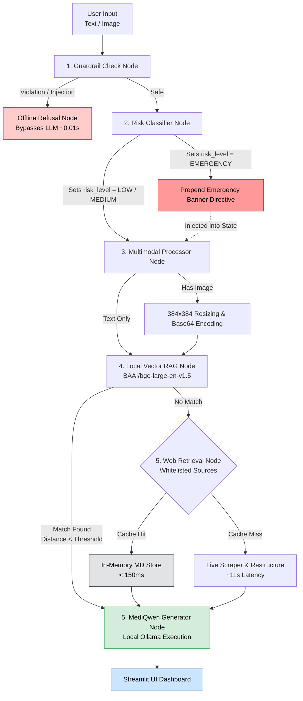

# 🩺 MediQwen: Edge Multimodal Clinical AI Engine

[](https://www.python.org/)
[](https://github.com/langchain-ai/langgraph)
[](https://ollama.ai/)
[](https://streamlit.io/)
[]()

---

## Overview

**MediQwen** is an **offline, privacy-first multimodal clinical assistant** powered by **Qwen 3.5** and built using **LangGraph's Finite State Machine (FSM)** architecture.

Unlike conventional chatbot pipelines, MediQwen combines deterministic state transitions, multimodal reasoning, hybrid retrieval, and multi-layer safety guardrails to provide reliable, evidence-grounded medical information while ensuring **all inference runs locally**.

> **No patient images, prompts, or medical information are transmitted to external cloud services.**

---

# ✨ Features

- 🔒 **100% Local Inference**
  - Runs entirely through Ollama with no cloud APIs; all patient data remains on the local device.

- 🧠 **Finite State Machine Agent**
  - LangGraph workflow for predictable execution, conversation routing, simplified debugging, and reliable state management

- 📷 **Multimodal Vision**
  - Supports clinical image understanding with automatic preprocessing, adaptive image normalization, and Base64 image handling.

- 📚 **Hybrid Retrieval-Augmented Generation**
  - Uses BAAI/bge-large-en-v1.5 embeddings with a local ChromaDB knowledge base, diversity-aware retrieval, and trusted web fallback when needed

- 📝 **Optimized Knowledge Pipeline** 
  - Converts raw medical documents into structured Markdown with hierarchical sectioning for faster indexing and more accurate retrieval

- ⚡ **Intelligent Web Cache**
  - Caches trusted medical content (NHS, WHO, Mayo Clinic) locally, reducing repeated retrieval latency from ~11 s to under 150 ms
  

- 🛡️ **Clinical Safety Layer**
  - Multi-layer safety with prompt injection detection, medical risk classification, and automatic emergency symptom prioritization

- 📊 **Interactive Streamlit Dashboard**
  - Streamlit interface featuring chat history, image previews, latency monitoring, backend status, and one-click session management

- 🧪 **Evaluation Framework**
  - Automated LangSmith evaluation with dual local LLM judges for RAG grounding, safety, and behavioral regression testing

---

# 🏗 System Architecture



---

# 🔄 Processing Pipeline

## 1. Safety Validation

Every request first passes through deterministic guardrails.

The system detects:

- Prompt injections
- Jailbreak attempts
- Unsafe instructions
- Restricted content

Unsafe requests are intercepted before reaching the language model.

---

## 2. Clinical Risk Assessment

Medical questions are classified into risk levels(EMERGENCY, MEDIUM, or LOW).

Examples include:

- Chest pain
- Stroke symptoms
- Severe allergic reactions
- Difficulty breathing

High-risk cases automatically prepend emergency guidance to the generated response.

---

## 3. Multimodal Processing

If an image is provided:

- Image normalization
- Adaptive resizing
- Base64 encoding
- Vision-language preparation

The processed image is then supplied directly to the local multimodal model.

---

## 4. Retrieval-Augmented Generation (RAG)

The system searches its local medical knowledge base before using online resources.

1. Medical documents are converted into structured Markdown for better semantic chunking
2. Uses BAAI/bge-large-en-v1.5 embeddings with a local ChromaDB vector database
3. Retrieves the most relevant context while filtering out low-quality matches

---

## 5. Intelligent Web Fallback

If relevant information is not found locally, MediQwen retrieves trusted online medical content.

- Searches only verified sources such as NHS, WHO, etc
- Cleans and caches retrieved content locally for future request


---
## 6. Response Generation

The final response combines the user's query, clinical images (if provided), retrieved medical knowledge, and risk assessment.

- Grounds responses in retrieved evidence to reduce hallucinations
- Presents findings with appropriate clinical uncertainty
- Encourages users to seek professional medical care when appropriate

---

# 📂 Project Structure

```text
MediQwen/
│
├── app/
├── config/
├── src/
│   ├── agent/
│   ├── preprocessing/
│   ├── safety/
│   ├── retrieval/
│   └── evaluation/
│
├── knowledge_base/
├── chroma_db/
├── tests/
├── notebooks/
├── requirements.txt
└── README.md
```

---

# 🚀 Installation

## Clone Repository

```bash
git clone https://github.com/your-username/MediQwen.git

cd MediQwen
```

## Create Virtual Environment

```bash
python -m venv .venv
```

Windows

```bash
.venv\Scripts\activate
```

Linux / macOS

```bash
source .venv/bin/activate
```

## Install Dependencies

```bash
pip install -r requirements.txt
```

---

# 🤖 Create the Local Model

```bash
ollama create mediqwen:latest -f Modelfile
```

---

# ▶ Run the Backend

```bash
python -m uvicorn app.api_server:app --reload --port 8000
```

---

# 💻 Launch the Streamlit Interface

```bash
streamlit run app/streamlit_interface.py
```

---

# 🧪 Testing

Run unit and integration tests

```bash
pytest tests/unit tests/integration -v
```

Run the evaluation pipeline

```bash
python tests/benchmark/evaluate_pipeline.py
```

Interactive evaluation notebooks are available in:

```
notebooks/03_quality_evaluation.ipynb
```

---

# 📊 Technologies

| Component | Technology |
|-----------|------------|
| LLM | Qwen 3.5 |
| Agent Framework | LangGraph |
| Vector Database | ChromaDB |
| Embeddings | BAAI/bge-large-en-v1.5 |
| Inference | Ollama |
| UI | Streamlit |
| API | FastAPI |
| Evaluation | LangSmith |
| Language | Python 3.10+ |

---

# 🔒 Privacy

MediQwen is designed for environments where data privacy is essential.

- No cloud inference
- No external APIs
- Local image processing
- Local vector database
- Offline language model execution

---

# ⚠ Disclaimer

MediQwen is intended for **research and educational purposes only**.

It is **not a medical device**, does **not diagnose diseases**, and should **not replace professional medical advice, diagnosis, or emergency care**. Users should always consult qualified healthcare professionals for clinical decisions.

---

## Future Work

- Improved medical image classification
- Expanded offline knowledge base
- Support for multilingual clinical queries
- Enhanced evaluation benchmarks
- Additional multimodal foundation models

---