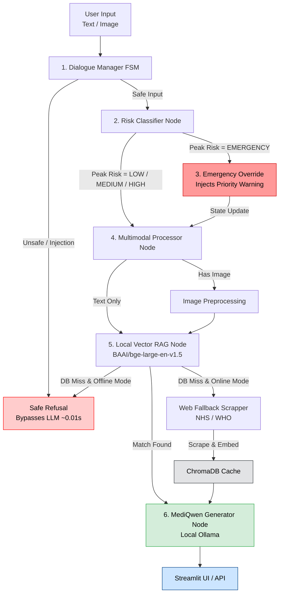

# 🩺 MediQwen: Edge Multimodal Clinical AI Engine

[](https://www.python.org/)
[](https://github.com/langchain-ai/langgraph)
[](https://ollama.ai/)
[](https://streamlit.io/)

---

## Overview

**MediQwen** is an **offline, privacy-first multimodal clinical assistant** powered by **Qwen 3.5** and built using **LangGraph's Finite State Machine (FSM)** architecture.

In remote, mountainous, and low-resource regions—such as rural communities in Nepal and other parts of the Himalayas—access to qualified healthcare professionals, diagnostic resources, and internet connectivity can be severely limited. MediQwen could help address some of these challenges by running 100% locally on edge hardware with zero internet dependency, providing evidence-grounded triage, multimodal clinical image analysis, and medical guidance to off-grid health centers, community health workers, and field assistants.

Unlike conventional chatbot pipelines, MediQwen combines deterministic state transitions, multimodal reasoning, hybrid retrieval, and multi-layer safety guardrails to provide reliable, evidence-grounded medical information while ensuring **all inference runs locally**.

> **No patient images, prompts, or medical information are transmitted to external cloud services.**

---

# ✨ Features

- 🔒 **100% Local Inference**
  - Runs entirely through Ollama with no cloud APIs; all patient data remains on the local device.

- 🧠 **Finite State Machine Agent**
  - LangGraph workflow for predictable execution, conversation routing, simplified debugging, and reliable state management.

- 📷 **Multimodal Vision**
  - Supports clinical image understanding with automatic preprocessing, adaptive image normalization, and Base64 image handling.

- 📚 **Hybrid Retrieval-Augmented Generation**
  - Uses BAAI/bge-large-en-v1.5 embeddings with a local ChromaDB knowledge base, diversity-aware retrieval, and trusted web fallback when needed.

- 📝 **Optimized Knowledge Pipeline** 
  - Converts raw medical documents into structured Markdown with hierarchical sectioning for faster indexing and more accurate retrieval.

- ⚡ **Intelligent Web Cache**
  - Caches trusted medical content (NHS, WHO, Mayo Clinic) locally, reducing repeated retrieval latency from ~11 s to under 150 ms.
  

- 🛡️ **Clinical Safety Layer**
  - Multi-layer safety with prompt injection detection, medical risk classification, and automatic emergency symptom prioritization.

- 📊 **Interactive Streamlit Dashboard**
  - Streamlit interface featuring chat history, image previews, latency monitoring, backend status, and one-click session management.

- 🧪 **Evaluation Framework**
  - Automated 8/8 scenario regression testing suite integrated with LangSmith.

---

# 🏗 System Architecture



---

# 🔄 Processing Pipeline

## 1. Dialogue Manager FSM & Safety Check

Every user message first passes through the Dialogue Manager, which acts as the system’s traffic controller. It uses a Finite State Machine (FSM) to determine whether the request is casual conversation, a medical question, nutrition guidance, or an image-based medical request.

Potential prompt injections and other malicious inputs are blocked immediately by deterministic guardrails, before any LLM is called. Safe requests continue through the appropriate clinical processing pipeline.

---

## 2. Clinical Risk Assessment

Medical questions are classified into risk levels(EMERGENCY, MEDIUM, or LOW).

- Informational Query ("What is a rash?")         ──► LOW Risk
- Active Self-Report ("I have a rash")            ──► MEDIUM Risk
- Worsening Modifier ("My rash is spreading")     ──► HIGH Risk
- Emergency Signature ("Crushing chest pain")     ──► EMERGENCY Risk

Emergency-risk cases automatically prepend emergency guidance to the generated response.

---

## 3. Multimodal Processing

If an image is provided:

- Image normalization
- Adaptive resizing
- Base64 encoding
- Vision-language preparation

The processed image is then supplied directly to the local multimodal model.

---

## 4. Retrieval-Augmented Generation (RAG)

The system searches its local medical knowledge base before using online resources.

1. Medical documents are converted into structured Markdown for better semantic chunking
2. Uses BAAI/bge-large-en-v1.5 embeddings with a local ChromaDB vector database
3. Retrieves the most relevant context while filtering out low-quality matches

---

## 5. Intelligent Web Fallback

If relevant information is not found locally, MediQwen retrieves trusted online medical content.

- Searches only verified sources such as NHS, WHO, Mayo Clinic etc
- Cleans and caches retrieved content locally for future request


---
## 6. Response Generation

The final response combines the user's query, clinical images (if provided), retrieved medical knowledge, and risk assessment.

- Grounds responses in retrieved evidence to reduce hallucinations
- Presents findings with appropriate clinical uncertainty
- Encourages users to seek professional medical care when appropriate

---

# 📂 Project Structure

```text
MediQwen/
│
├── app/
│   ├── api_server.py                 # FastAPI backend application 
│   └── streamlit_interface.py        # Streamlit interactive UI
│
├── config/      
│   ├── __init__.py                   # Config package initializer
│   ├── settings.py                   # System hyperparameters
│   └── skills.md                     # Clinical persona guidelines & system prompt directives
│
├── chroma_db/                        # Chroma Database
│
├── data/
│   └── knowledge_base/               # Markdown Documents
│
├── src/
│   ├── agent/
│   │   ├── __init__.py               # Agent package initializer
│   │   ├── graph.py                  # LangGraph FSM workflow compilation & switchboard routing
│   │   ├── nodes.py                  # Graph execution nodes (triage, RAG, refusal, generation)
│   │   └── state.py                  # Centralized agent state schema definition
│   │
│   ├── rag/
│   │   ├── __init__.py               # RAG package initializer
│   │   ├── vector_store.py           # ChromaDB hybrid vector search & distance thresholding
│   │   └── knowledge_base.py         # Markdown document ingestion, chunking & formatting pipeline
│   │
│   ├── safety/
│   │   ├── __init__.py               # Safety package initializer
│   │   ├── guardrails.py             # Pre-compiled regex prompt injection & jailbreak detectors
│   │   └── risk_classifier.py        # Multi-layer domain vs. severity triage engine
│   │
│   ├── tools/
│   │   ├── __init__.py               # Tools package initializer
│   │   ├── helpers.py                # Formatting & utility functions
│   │   ├── web_scraper.py            # Live NHS / Mayo Clinic scraper with auto-embedding
│   │   └── system_prompt.py          # Dynamic system prompt generator with state directives
│   │
│   └── preprocessing/
│       ├── __init__.py               # Preprocessing package initializer
│       └── image_processor.py        # Image normalization, aspect-ratio resizing & PNG Base64 buffer
│
├── tests/
│   ├── benchmark/
│   │   ├── __init__.py               # Benchmark package initializer
│   │   └── evaluate_pipeline.py      # Strict 8/8 scenario regression suite (LangSmith sync)
│   │
│   ├── integration/
│   │   ├── __init__.py               # Integration package initializer
│   │   └── test_graph.py             # End-to-end FSM state traversal & switchboard tests
│   │
│   └── unit/
│       ├── __init__.py               # Unit test package initializer
│       ├── test_api_server.py        # FastAPI server endpoint tests
│       ├── test_guardrails.py        # Injection detector & safety filter unit tests
│       ├── test_risk_classifier.py   # Triage severity & worsening escalation tests
│       └── test_retriever.py         # Vector store search threshold & score boundary tests
│
├── notebooks/
│   ├── 01_knowledge_base.ipynb       # KB preparation, chunking, and ChromaDB indexing
│   ├── 02_agentic_rag.ipynb          # LangGraph state machine assembly & interactive execution
│   └── 03_quality_evaluation.ipynb  # End-to-end benchmark execution & diagnostic analysis
│
├── Modelfile                         # Local Ollama model build file (Qwen 3.5 base)
├── requirements.txt                  # Python dependency specifications
├── .env                              # Local environment variables & API key configurations
├── pyproject.toml                    # Editable local package installer configuration (`pip install -e .`)
└── README.md                         # Primary project documentation & architecture guide
```

---

# 🚀 Installation

## Clone Repository

```bash
git clone https://github.com/your-username/MediQwen.git

cd MediQwen
```

## Create Virtual Environment

```bash
python -m venv .venv
```

Windows

```bash
.venv\Scripts\activate
```

Linux / macOS

```bash
source .venv/bin/activate
```

## Install Dependencies and local editable package

```bash
pip install -r requirements.txt
pip install -e .
```

---

# 🤖 Create the Local Model

```bash
ollama create mediqwen:latest -f Modelfile
```

---

# ▶ Run the Backend

```bash
python -m uvicorn app.api_server:app --reload --port 8000
```

---

# 💻 Launch the Streamlit Interface

```bash
streamlit run app/streamlit_interface.py
```

---

# 🧪 Testing

Run unit and integration tests

```bash
pytest tests/unit tests/integration -v
```

Run the evaluation pipeline

```bash
python tests/benchmark/evaluate_pipeline.py
```

## 📓 Interactive Notebook Workflows

The complete pipeline—from data ingestion to agentic RAG testing and quality evaluation—is available across three interactive Jupyter notebooks:

* **`notebooks/01_knowledge_base.ipynb`**: Markdown ingestion, BAAI embeddings, ChromaDB indexing, and hybrid vector search validation.
* **`notebooks/02_agentic_rag.ipynb`**: LangGraph FSM simulation, multimodal vision triage, web fallbacks, offline safe refusals, and injection blocks.
* **`notebooks/03_quality_evaluation.ipynb`**: Ollama health checks and the strict 8/8 scenario production regression suite.
---

## 🎯 **Production Benchmark Performance:**
> - **Evaluator Pass Rate:** 100% (8/8 LangSmith regression scenarios)
> - **Prompt Injection Interception:** < 10 ms (Deterministic Layer 1 FSM Intercept)
> - **Cached Web RAG Latency:** ~140 ms (78x speedup over live web scrapes)
> - **Offline Fallback Reliability:** 100% grounded refusal rate on zero-chunk DB misses
---

## 🎥 Demo

A recorded demonstration of the system:

- MediQwen Streamlit Interface: [View Demo](https://drive.google.com/file/d/1NHUlvXD4VJuJJ6OCb0r3D5H5NbM7cRTB/preview)

# 📊 Technologies

| Component | Technology |
|-----------|------------|
| LLM | Qwen 3.5 |
| Agent Framework | LangGraph |
| Vector Database | ChromaDB |
| Embeddings | BAAI/bge-large-en-v1.5 |
| Inference | Ollama |
| UI | Streamlit |
| API | FastAPI |
| Evaluation | LangSmith |
| Language | Python 3.10+ |

---

# 🔒 Privacy

MediQwen is designed for environments where data privacy is essential.

- No cloud inference
- No external APIs
- Local image processing
- Local vector database
- Offline language model execution

---

# ⚠ Disclaimer

MediQwen is intended for **research and educational purposes only**.

It is **not a medical device**, does **not diagnose diseases**, and should **not replace professional medical advice, diagnosis, or emergency care**. Users should always consult qualified healthcare professionals for clinical decisions.

---

## Future Work

- Improved medical image classification
- Expanded offline knowledge base for full offline architecture
- Support for multilingual clinical queries
- Enhanced evaluation benchmarks
- Additional multimodal foundation models

---