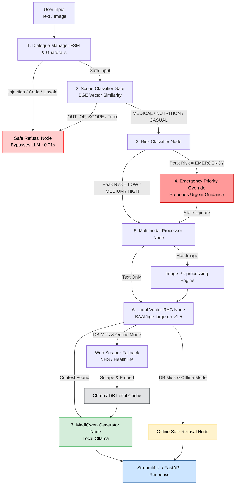

# 🩺 MediQwen: Edge Multimodal Clinical AI

[](https://www.python.org/)
[](https://github.com/langchain-ai/langgraph)
[](https://ollama.ai/)
[](https://streamlit.io/)

---

## Overview

**MediQwen** is an **offline, privacy-first multimodal clinical assistant** powered by **Qwen 3.5** and built using **LangGraph's Finite State Machine (FSM)** architecture.

In remote, mountainous, and low-resource regions—such as rural communities in Nepal and other parts of the Himalayas—access to qualified healthcare professionals, diagnostic resources, and internet connectivity can be severely limited. MediQwen could help address these challenges by running 100% locally on edge hardware with zero internet dependency, providing evidence-grounded triage, multimodal clinical image analysis, and medical guidance to off-grid health centers, community health workers, and field assistants.

Unlike conventional chatbot pipelines, MediQwen combines deterministic state transitions, multimodal reasoning, BGE-embedding scope classification, hybrid retrieval, and multi-layer safety guardrails to support more reliable, evidence-grounded medical responses. Core LLM inference runs locally through Ollama; optional online mode can use trusted web retrieval when local knowledge is insufficient.

> **Offline mode is designed so patient images, prompts, and medical information remain on the local machine. Online mode may access whitelisted medical web sources for retrieval fallback, so it should be used only when that external access is acceptable.**

---

# ✨ Features

- 🔒 **100% Local Inference**
  - Runs entirely through Ollama with no cloud dependencies; all patient data remains strictly on the local device.

- 🧠 **Finite State Machine Agent**
  - Built with LangGraph for deterministic execution, stateful conversation routing, multi-turn anaphora resolution, and transparent debugging.

- 🎯 **BGE Scope Classifier & Decision Gate**
  - Features high-confidence boundary gating and anaphoric context overrides to cleanly categorize queries into `MEDICAL`, `NUTRITION`, `CASUAL`, or `OUT_OF_SCOPE`.

- 📷 **Multimodal Clinical Vision**
  - Supports clinical image understanding with adaptive normalization, aspect-ratio resizing, and PNG Base64 buffer conversion.

- 📚 **Hybrid Retrieval-Augmented Generation**
  - Uses `BAAI/bge-large-en-v1.5` embeddings loaded via `src/models/embeddings.py` with a local ChromaDB vector store, score-thresholded diversity retrieval, and trusted web fallback when online.

- 📝 **Optimized Knowledge Pipeline** 
  - Converts raw medical documents into structured Markdown with hierarchical sectioning for high-precision semantic indexing.

- ⚡ **Intelligent Web Cache**
  - Caches whitelisted, trusted medical content (NHS, WHO, Mayo Clinic, Healthline) locally, drastically reducing repeated retrieval latency.

- 🛡️ **Hardened Safety Guardrails**
  - Layer 1 pre-compiled regex guards intercept prompt injections, system prompt leak attempts, self-harm, and technical code/programming requests before reaching the LLM.
  - Layer 2 risk classifier identifies medical risk tiers (`EMERGENCY`, `HIGH`, `MEDIUM`, `LOW`) and handles multi-turn worsening escalations.

- 📊 **Interactive Streamlit Dashboard**
  - Modern user interface featuring chat history, image previews, latency profiling, backend status indicators, and session management.

- 🧪 **Production Benchmark Harness**
  - Comprehensive 10-scenario regression evaluation matrix integrated with LangSmith, featuring strict rule evaluators and latency SLAs.

---

# 🏗 System Architecture



---

# 🔄 Processing Pipeline

## 1. Dialogue Manager FSM & Safety Check

Every user message first passes through the Dialogue Manager, which acts as the system’s traffic controller. It uses a Finite State Machine (FSM) to determine whether the request is casual conversation, a medical question, nutrition guidance, or an image-based medical request.

Potential prompt injections and other malicious inputs are blocked immediately by deterministic guardrails, before any LLM is called. Safe requests continue through the appropriate clinical processing pipeline.

---

## 2. BGE Scope Classification & Decision Gate

Safe inputs pass to the **`BGEScopeClassifier`**, which calculates cosine similarity against prototype intent vectors:

- **High-Confidence Gate:** High score & margin $\rightarrow$ Assigns **`MEDICAL`**, **`NUTRITION`**, **`CASUAL`**, or **`OUT_OF_SCOPE`**.
- **Anaphora Context Override:** Low margin or ambiguous query (e.g., *"How can we treat it?"*) with an active **`clinical_subject`** $\rightarrow$ Resolves context and routes as **`MEDICAL`**.
- **Technical Intercept Rule:** Technical or code requests override active clinical context to prevent domain misuse.

---

## 3. Clinical Risk Assessment

Medical questions are classified into risk levels(EMERGENCY, MEDIUM, or LOW).

- Informational Query ("What is a rash?")         ──► LOW Risk
- Active Self-Report ("I have a rash")            ──► MEDIUM Risk
- Worsening Modifier ("My rash is spreading")     ──► HIGH Risk
- Emergency Signature ("Crushing chest pain")     ──► EMERGENCY Risk

Emergency-risk cases automatically prepend emergency guidance to the generated response.

---

## 4. Multimodal Processing

If an image is provided:

- Image normalization
- Adaptive resizing
- Base64 encoding
- Vision-language preparation

The processed image is then supplied directly to the local multimodal model.

---

## 5. Retrieval-Augmented Generation (RAG)

The system searches its local medical knowledge base before using online resources.

1. Medical documents are converted into structured Markdown for better semantic chunking
2. Uses BAAI/bge-large-en-v1.5 embeddings with a local ChromaDB vector database
3. Retrieves the most relevant context while filtering out low-quality matches

---

## 5. Intelligent Web Fallback

If relevant information is not found locally, MediQwen retrieves trusted online medical content.

- Searches only verified sources such as NHS, WHO, Mayo Clinic etc
- Cleans and caches retrieved content locally for future request


---
## 6. Response Generation

The final response combines the user's query, clinical images (if provided), retrieved medical knowledge, and risk assessment.

- Grounds responses in retrieved evidence to reduce hallucinations
- Presents findings with appropriate clinical uncertainty
- Encourages users to seek professional medical care when appropriate

---

# 📂 Project Structure

```text
MediQwen/
│
├── app/
│   ├── api_server.py                 # FastAPI REST server application
│   └── streamlit_interface.py        # Streamlit interactive dashboard UI
│
├── config/      
│   ├── __init__.py                   # Config package initializer
│   ├── settings.py                   # System hyperparameters & thresholds
│   └── skills/                       # Clinical persona & specialized skill directives
│       ├── casual_chat.md     
│       ├── clinical_triage.md      
│       ├── multimodal_triage.md      
│       └── evidence_synthesis.md     
│
├── chroma_db/                        # Persistent ChromaDB vector database
│
├── data/
│   ├── knowledge_base/               # Medical Markdown source documents
│   └── test_assets/                  # Clinical vision test images (e.g., hives.jpg)
│
├── src/
│   ├── agent/
│   │   ├── __init__.py               # Agent package initializer
│   │   ├── graph.py                  # LangGraph FSM workflow compilation & switchboard routing
│   │   ├── nodes.py                  # Graph execution nodes (triage, RAG, refusal, generation)
│   │   ├── state.py                  # Centralized AgentState schema definition
│   │   └── skills_loader.py          # Config loader for Markdown clinical persona skills
│   │
│   ├── models/
│   │   ├── __init__.py               # Models package initializer
│   │   └── embeddings.py             # Singleton BAAI/bge-large-en-v1.5 embedding model loader
│   │
│   ├── rag/
│   │   ├── __init__.py               # RAG package initializer
│   │   ├── vector_store.py           # ChromaDB hybrid vector search & distance thresholding
│   │   └── knowledge_base.py         # Markdown document ingestion, chunking & formatting pipeline
│   │
│   ├── safety/
│   │   ├── __init__.py               # Safety package initializer
│   │   ├── guardrails.py             # Layer 1 prompt injection, self-harm & code interceptors
│   │   ├── risk_classifier.py        # Domain vs. severity risk triage engine
│   │   └── scope_classifier.py       # BGE vector scope classifier & decision gate
│   │
│   ├── tools/
│   │   ├── __init__.py               # Tools package initializer
│   │   ├── helpers.py                # Formatting & utility functions
│   │   ├── web_scraper.py            # Live web scraper with automatic local caching
│   │   └── system_prompt.py          # Dynamic system prompt generator with state directives
│   │
│   └── preprocessing/
│       ├── __init__.py               # Preprocessing package initializer
│       └── image_processor.py        # Image normalization & PNG Base64 buffer generator
│
├── tests/
│   ├── benchmark/
│   │   ├── __init__.py               # Benchmark package initializer
│   │   └── evaluate_pipeline.py      # 10-scenario production regression suite (LangSmith sync)
│   │
│   ├── integration/
│   │   ├── __init__.py               # Integration package initializer
│   │   └── test_graph.py             # End-to-end LangGraph state machine tests
│   │
│   └── unit/
│       ├── __init__.py               # Unit test package initializer
│       ├── test_api_server.py        # FastAPI server endpoint validation tests
│       ├── test_guardrails.py        # Input/output safety guardrail unit tests
│       ├── test_risk_classifier.py   # Triage severity & worsening escalation tests
│       └── test_scope_classifier.py  # Scope classifier gate & anaphora override tests
│
├── notebooks/
│   ├── 01_knowledge_base.ipynb       # KB preparation, chunking, and ChromaDB indexing
│   ├── 02_agent_nodes_validation.ipynb # Agentic nodes validation & FSM switchboard execution
│   ├── 03_scope_classifier.ipynb     # Scope classifier threshold tuning & grid search analysis
│   └── 04_quality_evaluation.ipynb  # Direct guardrail diagnostics & 10-scenario benchmark execution
│
├── Modelfile                         # Local Ollama model build file
├── requirements.txt                  # Python dependency specifications
├── .env                              # Local environment variables & API configurations
├── pyproject.toml                    # Editable local package installer configuration (`pip install -e .`)
└── README.md                         # Primary project documentation & architecture guide
```

---

# 🚀 Installation

## Clone Repository

```bash
git clone [https://github.com/SantosRana/MediQwen.git](https://github.com/SantosRana/MediQwen.git)

cd MediQwen
```

## Create Virtual Environment

```bash
python -m venv .venv
```

Windows

```bash
.venv\Scripts\activate
```

Linux / macOS

```bash
source .venv/bin/activate
```

## Install Dependencies and local editable package

```bash
pip install -r requirements.txt
pip install -e .
```

---

# 🤖 Create the Local Model

```bash
ollama create mediqwen:latest -f Modelfile
```

---

# ▶ Run the Backend

```bash
python -m uvicorn app.api_server:server --reload --port 8000
```

---

# 💻 Launch the Streamlit Interface

```bash
streamlit run app/streamlit_interface.py
```

---

# 🧪 Testing

Run unit and integration tests

```bash
pytest tests/unit tests/integration -v
```

Run the evaluation pipeline

```bash
python tests/benchmark/evaluate_pipeline.py
```
**`Note: tests/benchmark/evaluate_pipeline.py is also directly imported and evaluated inside notebooks/04_quality_evaluation.ipynb for interactive diagnostic runs and report generation.`**

## 📓 Interactive Notebook Pipeline

- **`notebooks/01_knowledge_base.ipynb`**: Knowledge base ingestion, BAAI embeddings, ChromaDB indexing, and vector search verification.
- **`notebooks/02_agent_nodes_validation.ipynb`**: LangGraph agent node validation, multimodal vision triage, web fallbacks, offline safe refusals, and injection blocks.
- **`notebooks/03_scope_classifier.ipynb`**: BGE scope classifier grid search, threshold tuning ($0.50$ score, $0.05$ margin), and gate analysis.
- **`notebooks/04_quality_evaluation.ipynb`**: Direct guardrail unit diagnostic checks and execution of the 10-scenario benchmark matrix.

## 🎯 Production Benchmark Performance

### **BGE Scope Classifier Evaluation (140 Test Queries)**
* **Overall Classification Accuracy:** **92.86%** (130 / 140 queries correctly gated)
* **Domain Performance Metrics:**
  * **`OUT_OF_SCOPE`:** **1.00 Precision** | 0.90 Recall | 0.95 F1-Score *(Zero false positives; strictly blocks non-medical technical/jailbreak queries)*
  * **`NUTRITION`:** 0.91 Precision | **1.00 Recall** | 0.95 F1-Score *(Captures 100% of dietary and lifestyle queries)*
  * **`CASUAL`:** 0.83 Precision | **1.00 Recall** | 0.91 F1-Score *(Ensures conversational queries pass without triggering RAG)*
  * **`MEDICAL`:** **0.97 Precision** | 0.85 Recall | 0.91 F1-Score *(High-precision routing to prevent clinical false positives)*

### **LangGraph Pipeline & End-to-End Regression Matrix**
* **10-Scenario Evaluator Pass Rate:** **100%** (10/10 LangSmith production regression scenarios cleared)
* **Layer 1 Guardrail Interception:** **< 10 ms** (Deterministic FSM intercept for injections and code requests)
* **Cached Web RAG Latency:** **~140 ms** (Local ChromaDB cache)

---


## 🎥 Demo

A recorded demonstration of the system:

- MediQwen Streamlit Interface: [View Demo](https://drive.google.com/file/d/1NHUlvXD4VJuJJ6OCb0r3D5H5NbM7cRTB/preview)

# 📊 Technologies

| Component | Technology |
|-----------|------------|
| LLM | Qwen 3.5 |
| Agent Framework | LangGraph |
| Vector Database | ChromaDB |
| Embeddings | BAAI/bge-large-en-v1.5 |
| Inference | Ollama |
| UI | Streamlit |
| API | FastAPI |
| Evaluation | LangSmith |
| Language | Python 3.10+ |

---

# 🔒 Privacy

MediQwen is designed for environments where data privacy is essential.

- **100% Local LLM Execution** via Ollama.
- **Local Clinical Inference:** Patient queries and image inputs are processed by the local LLM pipeline rather than sent to a cloud LLM API. In online mode, external retrieval may still transmit the retrieval request to configured web sources.
- **Local Vector Persistence:** Knowledge embeddings and cached web contexts remain stored in local ChromaDB stores.

---

# ⚠ Disclaimer

MediQwen is intended for **research and educational purposes only**.

It is **not a medical device**, does **not diagnose diseases**, and should **not replace professional medical advice, diagnosis, or emergency care**. Users should always consult qualified healthcare professionals for clinical decisions.

---

## Future Work

- Semantic safety and prompt-injection detection beyond fixed patterns.
- Expanded offline medical knowledge base.
- Improved multimodal clinical reasoning.
- Adaptive retrieval and evidence ranking.
- Multilingual query and response support.
- Deployment optimization for low-power edge hardware.
- Human-in-the-loop clinical review workflows.

---